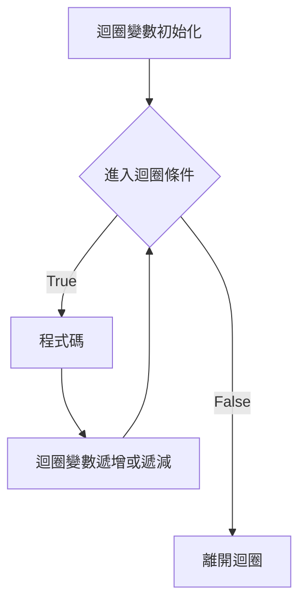
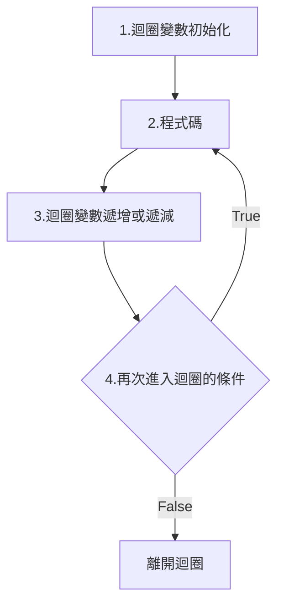
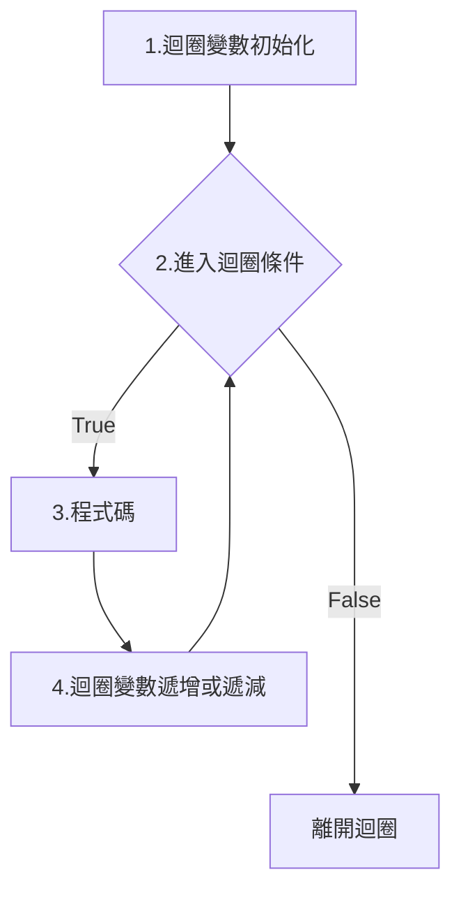
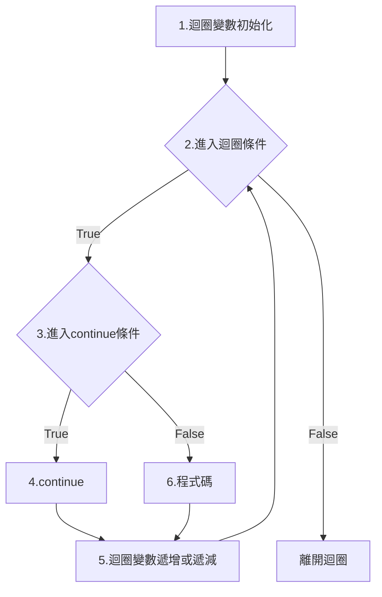
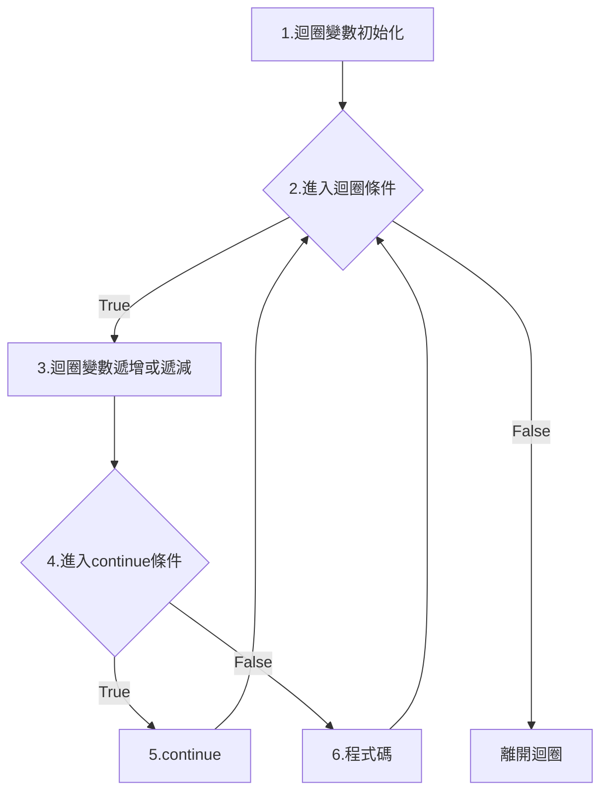

## 關係運算子
### 相同數字大於小於
相同數字的大於小於都是false。

boolean flag = 10 > 10;
System.out.println("10大於10 = " + flag);
flag = 1 < 1;
System.out.println("1小於1 = " + flag);

```
10大於10 = false
1小於1 = false
```

### false為離開迴圈的條件
以下10與1就是離開迴圈的條件。
```
10大於10 = false
1小於1 = false
```

## while
主要有四個部分。
1. 迴圈變數初始化。
2. 「進入」迴圈條件。
3. 執行的程式碼。
4. 迴圈變數遞增或遞減。

重點
1. 迴圈條件是boolean，真或假。
2. 要有迴圈變數遞增或遞減，最後變數符合離開迴圈的條件。<br>
3. 如果沒有迴圈變數沒有變化，會形成無窮迴圈。<br>
4. 迴圈變數遞增或遞減可放在最後面，或放在「執行程式碼」前面。<br>
```
迴圈變數初始化
while(進入迴圈條件) {
  程式碼;
  迴圈變數遞增或遞減
}
```




// 迴圈變數初始化
int i = 1;
// 進入迴圈條件
while(i < 10) {
  // 程式碼 印出1到9
  System.out.println(i);
  // 迴圈變數遞增
  i++;
}


### 離開迴圈的條件
i在迴圈的變化如下:<br>
i = ~~1~~ ~~2~~ ~~3~~ ~~4~~ ~~5~~ ~~6~~ ~~7~~ ~~8~~ ~~9~~ <span class="markline">10</span> <br>
<span class="markline">10</span>是離開迴圈的條件，因為`10 < 10`，相同數字大於小於就是false，false為離開迴圈的條件。<br>


// 迴圈變數初始化
int i = 1;
// 進入迴圈條件
while(i < 10) {
  // 程式碼 印出1到9
  System.out.println(i);
  // 迴圈變數遞增
  i++;
}
System.out.println("離開迴圈的i = " + i);

```
1
2
3
4
5
6
7
8
9
離開迴圈的i = 10
```

### 印出1至9之間的偶數。

// 迴圈變數初始化
int i = 1;
// 進入迴圈條件
while(i < 10) {
  // 印出偶數，判斷i若能整除2，餘數為0，就印出
  if (i % 2 == 0) {
    System.out.println(i);
  }
  // 迴圈變數遞增
  i++;
}

```
2
4
6
8
```

執行完遞增後，會回到進入迴圈條件，判斷是否能進入迴圈。<br>
<br>

## do while
先執行，再判斷。<br>

### 語法
主要有四個部分。
1. 迴圈變數初始化。
2. 再次「進入」迴圈條件。
3. 執行的程式碼
4. 迴圈變數遞增或遞減。

重點
1. 進入迴圈條件是boolean，真或假。
2. 要有迴圈變數遞增或遞減，最後變數符合離開迴圈的條件。
3. 如果沒有迴圈變數沒有變化，會形成無窮迴圈。
4. 迴圈變數遞增或遞減可放在最後面，或放在「執行程式碼」前面。
5. 至少會進入迴圈1次。
6. while(條件)<span class="markline">;</span>後面有分號。 
```
1迴圈變數初始化
do {
  2程式碼
  3迴圈變數遞增或遞減
} while(4再次進入迴圈的條件);
```

### 流程圖


### 程式碼1

int i = 1;
do {
  System.out.println(i);
  i++;
} while (i < 10);
System.out.println("離開迴圈的i = " + i);

```
1
2
3
4
5
6
7
8
9
離開迴圈的i = 10
```
#### 離開迴圈的條件
i在迴圈的變化如下:<br>
i = ~~1~~ ~~2~~ ~~3~~ ~~4~~ ~~5~~ ~~6~~ ~~7~~ ~~8~~ ~~9~~ <span class="markline">10</span> <br>
<span class="markline">10</span>是離開迴圈的條件，因為`10 < 10`，相同數字大於小於就是false，false為離開迴圈的條件。<br>

### 程式碼2
使用Scanner放在迴圈之外，「離開」迴圈條件為ans要等於10。<br>

Scanner scanner = new Scanner(System.in);
int ans = 0;
do {
  System.out.println("請輸入5 + 5=");
  ans = scanner.nextInt();  // int
} while (ans != 10);

```
請輸入5 + 5=
5
請輸入5 + 5=
2
請輸入5 + 5=
10
```

## for
主要有四個部分。
1. 迴圈變數初始化。
2. 「進入」迴圈條件。
3. 執行的程式碼
4. 迴圈變數遞增或遞減。

重點
1. 進入迴圈條件是boolean，真或假。
2. 要有迴圈變數遞增或遞減，最後變數符合離開迴圈的條件。<br>
3. 如果沒有迴圈變數沒有變化，會形成無窮迴圈。<br>
4. 迴圈變數遞增或遞減放在`for(;;)`第2個分號`;`後面。<br>
```
for(1迴圈變數初始化;2進入迴圈條件;4迴圈變數遞增或遞減) {
  3程式碼;
}
```



印出1到9。

for (int i = 1; i < 10; i++) {
  System.out.println(i);
}


### 離開迴圈的條件
i在迴圈的變化如下:<br>
i = ~~1~~ ~~2~~ ~~3~~ ~~4~~ ~~5~~ ~~6~~ ~~7~~ ~~8~~ ~~9~~ <span class="markline">10</span> <br>
<span class="markline">10</span>是離開迴圈的條件。<br>

console:<br>
```
1
2
3
4
5
6
7
8
9
```
### 初始化
迴圈變數可以寫在`for()`之外，但分號`;`還是要留著。<br>
```
1迴圈變數初始化
for(;2進入迴圈條件;4迴圈變數遞增或遞減) {
  3程式碼;
}
```
印出1到9。<br>

int i = 1;
for (; i < 10; i++) {
  System.out.println(i);
}


### 初始化寫在外面
迴圈變數初始化在for裡面，那存取範圍只在for迴圈之中。<br>
以下會編譯錯誤，因為離開for迴圈，找不到i變數。<br>

for (int i = 1; i < 10; i++) {
  System.out.println(i);
}
System.out.println("離開迴圈的i = " + i);


以下不會編譯錯誤，因為迴圈變數在for之前就先初始化。<br>

int i = 1;
for (; i < 10; i++) {
  System.out.println(i);
}
System.out.println("離開迴圈的i = " + i);

```
1
2
3
4
5
6
7
8
9
離開迴圈的i = 10
```
<span class="markline">10</span>是離開迴圈的條件。

### 遞增寫在迴圈中
遞增寫在迴圈中，但分號`;`還是要留著。

int i = 1;
for (; i < 10;) {
  System.out.println(i);
  i++;
}
System.out.println("離開迴圈的i = " + i);

```
1
2
3
4
5
6
7
8
9
離開迴圈的i = 10
```
### 多個迴圈變數
前面不用再加上類型int，用逗點`,`區分開來。


int count = 3;
for (int i = 0, j = 0; i < count; i++, j+=2) {
  System.out.println("i = " + i + ", j = " + j);
}


i與j在記憶體的變化如下，i為3是離開迴圈的條件。<br>
i = ~~0~~ ~~1~~ ~~2~~ 3<br>
j = ~~0~~ ~~2~~ ~~4~~ 6<br>

console<br>
```
i = 0, j = 0
i = 1, j = 2
i = 2, j = 4
```

### for無窮迴圈
以下的for程式碼，沒有條件判斷，是無窮迴圈，需要使用break跳出迴圈。

int i = 1;
for (;;) {
  System.out.println(i);
  i++;
}


## break離開迴圈的條件
語法
```
if(條件為true) break;
```
注意！條件為「true」，「離開」迴圈。
### 大於
當i等於10，`10 > 10`，10沒有大於10，先前提過關係運算子，相同數字大於小於都是false，沒有離開迴圈。<br>所以仍會執行i\+\+，i為11，條件才會為true，符合離開迴圈的條件。<br>

int i = 1;
for (;;) {
  if (i > 10) break;
  System.out.println(i);
  i++;
}
System.out.println("離開的i = " + i);

```
1
2
3
4
5
6
7
8
9
10
離開的i = 11
```
### 小於
當i等於1，1沒有小於1，先前提過關係運算子，相同數字大於小於都是false，所以仍會執行i\-\-，i為0才是離開迴圈的條件。

int i = 10;
for (;;) {
  if (i < 1) break;
  System.out.println(i);
  i--;
}
System.out.println("離開的i = " + i);

```
10
9
8
7
6
5
4
3
2
1
離開的i = 0
```
### 題目
請問以下程式結果？

int num = 1;
while (num < 10) {
  System.out.println(num);
  if (num > 5) {
    break;
  }
  num += 2;
}


num = ~~1~~ ~~3~~ ~~5~~ 7<br>

7才是觸發break離開迴圈的條件，不是5。

5 \> 5 ，break是條件為true才離開迴圈，先前關係運算子已經提過，相同數字大於小於，都為false，因為不是true，所以不能離開迴圈，繼續往下執行。

console:
```
1
3
5
7
```

## continue
### continue與for
for的continue會先執行「迴圈變數遞增」，再執行「進入迴圈條件」。

主要有六個部分。
1. 迴圈變數初始化。
2. 「進入」迴圈條件。
3. 執行的程式碼
4. 迴圈變數遞增或遞減。
5. 進入continue條件
6. continue

```
for(1迴圈變數初始化;2進入迴圈條件;5迴圈變數遞增或遞減) {
  if (3進入continue條件) {
    4continue
  }
  6程式碼
}
```

流程圖如下:


以下i等於2，就不印出。

for (int i = 0; i < 5; i++) {
  if (i == 2) {
    continue;
  }
  System.out.println(i);
}

```
0
1
3
4
```

注意下圖執行順序，continue執行完，執行「i\+\+」迴圈變數遞增，然後再執行「進入迴圈條件」。<br>


### while與continue
continue在while之中，是直接執行「進入迴圈條件」，continue之後的程式碼全部不執行。

注意！迴圈變數遞增遞減，一定要放在continue<span class="markline">之前</span>。<br>
如果「迴圈變數遞增遞減」放在continue「之後」，continue「之後」的程式碼全部「不執行」，
迴圈變數沒有遞增遞減，沒有逐漸符合離開迴圈條件，會變成無窮迴圈。<br>

程式碼

int i = 0;
while (i < 5) {
  i++;
  if (i == 2) {
    continue;
  }
  System.out.println(i);
}

```
1
3
4
5
```

流程圖


```
1.迴圈變數初始化
while (2.進入迴圈條件) {
  3.迴圈變數遞增或遞減
  if (4.進入continue條件) {
    5.continue;
  }
  6.程式碼
}
```
注意下圖執行順序，continue執行完，執行「進入迴圈條件」。<br>


## 化繁為簡
一個複雜的需求，要先把需求變成最簡單，先把程式碼寫死，最後才把程式碼寫死的部分變成變數。

### 題目1
統計1到100(包含100)中3的倍數的數量，與3的倍數的總合。

化繁為簡:<br>

1.先寫console顯示1到100。

for(int i = 1; i <= 100; i++) {
  // console顯示1到100
  System.out.print(i + "\t");
}


2.統計1-100的數量count。

int count = 0;
for(int i = 1; i <= 100; i++) {
  System.out.print(i + "\t");
  // 統計1-100的數量count
  count++;
}


3.統計1-100的總合sum。

int count = 0;
int sum = 0;
for(int i = 1; i <= 100; i++) {
  System.out.print(i + "\t");
  count++;
  // 統計1-100的總合sum
  sum += i;
}


4.加上判斷i是否為3的倍數

int count = 0;
int sum = 0;
for (int i = 1; i <= 100; i++) {
  // 判斷i是否為3的倍數
  if (i % 3 == 0) {
    System.out.print(i + "\t");
    count++;
    sum += i;
  }
}
System.out.println(); // 換行
System.out.println("3的倍數數量count = " + count);
System.out.println("3的倍數總合sum = " + sum);

```
3	6	9	12	15	18	21	24	27	30	33	36	39	42	45	48	51	54	57	60	63	66	69	72	75	78	81	84	87	90	93	96	99	
3的倍數數量count = 33
3的倍數總合sum = 1683
```

5.把寫死的數字變成變數，如:題目改為6倍、9倍。

int count = 0;
int sum = 0;
int times = 9;
for (int i = 1; i <= 100; i++) {
  // 判斷i是否為X的倍數
  if (i % times == 0) {
    System.out.print(i + "\t");
    count++;
    sum += i;
  }
}
System.out.println(); // 換行
System.out.println(times + "的倍數數量count = " + count);
System.out.println(times + "的倍數總合sum = " + sum);


### 題目2
統計1到100(包含100)，能被3整除的數字，但不能被5整除的數字，總共數量。<br>

int count = 0;
for (int i = 1; i <= 100; i++) {
  if (i % 3 == 0 && i % 5 != 0) {
    System.out.print(i + "\t");
    count++;
  }
}
System.out.println(); // 換行
System.out.println("數量count = " + count);

```
3	6	9	12	18	21	24	27	33	36	39	42	48	51	54	57	63	66	69	72	78	81	84	87	93	96	99	
數量count = 27
```

每五個換行。

int count = 0;
for (int i = 1; i <= 100; i++) {
  if (i % 3 == 0 && i % 5 != 0) {
    System.out.print(i + "\t");
    count++;
    if (count % 5 == 0) {
      System.out.println();  // 換行
    }
  }
}
System.out.println(); // 換行
System.out.println("數量count = " + count);

```
3 6 9 12  18  
21  24  27  33  36  
39  42  48  51  54  
57  63  66  69  72  
78  81  84  87  93  
96  99  

```

### 題目3
請印出以下內容。
```
0 + 5 = 5
1 + 4 = 5
2 + 3 = 5
3 + 2 = 5
4 + 1 = 5
5 + 0 = 5
```
加號左邊分別為0,1,2,3,4,5<br>
也就是i由0,1,2,3,4,5遞增，作為加號左邊的數字。<br>
0 + 5 ，請問i = 0 與加號右邊的5有什麼樣的關係？<br>
1 + 4 ，請問i = 1 與加號右邊的4有什麼樣的關係？<br>
2 + 3 ，請問i = 2 與加號右邊的3有什麼樣的關係？<br>

加號右邊的數字，可發現5 - i，隨著i的遞增，可求出加號右邊的數字。<br>
5 - i = X<br>
5 - 0 = 5<br>
5 - 1 = 4<br>
5 - 2 = 3<br>

1.先顯示加號左邊0到5(包含5)的數字。

for (int i = 0; i <= 5; i++) {
  System.out.println(i);
}


2.顯示加號右邊5,4,3,2,1的數字

for (int i = 0; i <= 5; i++) {
  System.out.println(i + " + " + (5 - i) + " = 5");
}


## 2層迴圈
寫出99乘法表。<br>

1.化繁為簡，先寫出1的99乘法表。<br>
```
1 * 1 = 1
1 * 2 = 2
1 * 3 = 3
1 * 4 = 4
1 * 5 = 5
1 * 6 = 6
1 * 7 = 7
1 * 8 = 8
1 * 9 = 9
```

int num = 1;
for (int j = 1; j <= 9; j++) {
  System.out.println(num + " * " + j + " = " + (num * j));
}


以上執行<span class="markline">9次</span>System.out.println()

2.相同的程式碼複製9次，只要變更num的值。

int num = 1;
System.out.println("==== " + num + " ====");
for (int j = 1; j <= 9; j++) {
  // 執行9次
  System.out.println(num + " * " + j + " = " + (num * j));
}

num = 2;
System.out.println("==== " + num + " ====");
for (int j = 1; j <= 9; j++) {
  // 執行9次
  System.out.println(num + " * " + j + " = " + (num * j));
}

num = 3;
System.out.println("==== " + num + " ====");
for (int j = 1; j <= 9; j++) {
  // 執行9次
  System.out.println(num + " * " + j + " = " + (num * j));
}

num = 4;
System.out.println("==== " + num + " ====");
for (int j = 1; j <= 9; j++) {
  // 執行9次
  System.out.println(num + " * " + j + " = " + (num * j));
}

num = 5;
System.out.println("==== " + num + " ====");
for (int j = 1; j <= 9; j++) {
  // 執行9次
  System.out.println(num + " * " + j + " = " + (num * j));
}

num = 6;
System.out.println("==== " + num + " ====");
for (int j = 1; j <= 9; j++) {
  // 執行9次
  System.out.println(num + " * " + j + " = " + (num * j));
}

num = 7;
System.out.println("==== " + num + " ====");
for (int j = 1; j <= 9; j++) {
  // 執行9次
  System.out.println(num + " * " + j + " = " + (num * j));
}

num = 8;
System.out.println("==== " + num + " ====");
for (int j = 1; j <= 9; j++) {
  // 執行9次
  System.out.println(num + " * " + j + " = " + (num * j));
}

num = 9;
System.out.println("==== " + num + " ====");
for (int j = 1; j <= 9; j++) {
  // 執行9次
  System.out.println(num + " * " + j + " = " + (num * j));
}


4.把重覆的程式碼縮減成只寫一次，重覆的事，就由迴圈去做，迴圈把重覆的程式碼，執行9次。

for (int i = 1; i <= 9; i++) {
  // 執行以下程式碼9次
  num = 1;
  System.out.println("==== " + num + " ====");
  for (int j = 1; j <= 9; j++) {
    // 執行9次
    System.out.println(num + " * " + j + " = " + (num * j));
  }
}


5.num的變化是1,2,3,4,5,6,7,8,9，發現跟迴圈變數i遞增的情況一模一樣是1,2,3,4,5,6,7,8,9。<br>
將迴圈變數i取代num。<br>

for (int i = 1; i <= 9; i++) {
  // 執行以下程式碼9次
  System.out.println("==== " + i + " ====");
  for (int j = 1; j <= 9; j++) {
    // 執行9次
    System.out.println(i + " * " + j + " = " + (i * j));
  }
}


### 二層迴圈的執行迴圈次數
從上面的解說，外層迴圈是把相同程式碼複製成9份，執行次數是9次。<br>
但內部迴圈也是執行9次System.out.println()。<br>

int num = 1;
for (int j = 1; j <= 9; j++) {
  // 執行9次
  System.out.println(num + " * " + j + " = " + (num * j));
}


以上執行9次System.out.println()

所以外層迴圈執行9次，內部迴圈執行9次，總共執行次數是$9 \times 9 = 81$，注意！不是9 + 9。

### 二層迴圈的執行順序
```
for (1外層迴圈變數初始化; 2進入外層迴圈條件; 8外層迴圈變數遞增) {
  3外層執行的程式碼
  for (4內層迴圈變數初始化; 5進入內層迴圈條件; 7內層迴圈變數遞增) {
     6內層執行的程式碼
    }
}
```
內層迴圈執行結束，才執行外層迴圈變數遞增。

### 二層迴圈的i,j記憶體變化

for (int i = 0; i < 2; i++) {
  for (int j = 0; j < 3; j++) {
    System.out.println("i = " + i + ",j = " + j);
  }
}


i = 0<br>
j = ~~0~~ ~~1~~ ~~2~~ 3<br>
j為3是離開內部迴圈的條件。<br>

i = 1<br>
j = ~~0~~ ~~1~~ ~~2~~ 3<br>
j為3是離開內部迴圈的條件。<br>

i = 2, 2 < 2 前面提過關係運算子，相同數字大於小於，就是false。<br>
i為2是離開外部迴圈的條件。<br>

執行結果如下:
```
i = 0,j = 0
i = 0,j = 1
i = 0,j = 2
i = 1,j = 0
i = 1,j = 1
i = 1,j = 2
```

## 三角形
題目如下:
```
*
**
***
****
*****
```
1.用迴圈印出每一層的星星數量，以下程式碼星星的數量由num控制。

int num = 1;
for (int j = 1; j <= num; j++) {
  System.out.print("*");
}
System.out.println();  //換行 
num = 2;
for (int j = 1; j <= num; j++) {
  System.out.print("*");
}
System.out.println();  //換行

num = 3;
for (int j = 1; j <= num; j++) {
  System.out.print("*");
}
System.out.println();  //換行
num = 4;
for (int j = 1; j <= num; j++) {
  System.out.print("*");
}
System.out.println();  //換行

num = 5;
for (int j = 1; j <= num; j++) {
  System.out.print("*");
}
System.out.println();  //換行

<br>
2.以下是一模一樣的程式碼，重覆寫了5次。

for (int j = 1; j <= num; j++) {
  System.out.print("*");
}
System.out.println();  //換行

<br>
3.把重覆的程式碼縮減成只寫一次，重覆的事，就由迴圈去做，迴圈把重覆的程式碼，執行5次。

for (int i = 1; i <= 5; i++) {
  int num = 1;
  for (int j = 1; j <= num; j++) {
    System.out.print("*");
  }
  System.out.println();  //換行
}

<br>
4.num的變化是1,2,3,4,5，發現跟迴圈變數i遞增的情況一模一樣是1,2,3,4,5。<br>
將迴圈變數i取代num。<br>

for (int i = 1; i <= 5; i++) {
  for (int j = 1; j <= i; j++) {
    System.out.print("*");
  }
  System.out.println();  //換行
}


5.請印出以下的星星，請用2的倍數來思考。
```
**         第1層 層數1 * 2 = 2個星  
****       第2層 層數2 * 2 = 4個星
******     第3層 層數3 * 2 = 6個星
********   第4層 層數4 * 2 = 8個星
********** 第5層 層數5 * 2 = 10個星
```
第x層，x就是i迴圈變數，i迴圈變數由1,2,3,4,5遞增。<br>

for (int i = 1; i <= 5; i++) {
  int num = 2 * i;
  for (int j = 1; j <= num; j++) {
    System.out.print("*");
  }
  System.out.println();  //換行
}


6.每一層再減少1個星。
```
*         第1層 層數1 * 2 - 1 = 1個星  
***       第2層 層數2 * 2 - 1 = 3個星
*****     第3層 層數3 * 2 - 1 = 5個星
*******   第4層 層數4 * 2 - 1 = 7個星
********* 第5層 層數5 * 2 - 1 = 9個星
```

for (int i = 1; i <= 5; i++) {
  // 每一層再減少1個星
  int num = (2 * i) - 1;
  for (int j = 1; j <= num; j++) {
    System.out.print("*");
  }
  System.out.println();  //換行
}


7.印出星號左邊的空格
```
    *     第1層 總層數5 - 目前層數1 = 4個空格
   ***    第2層 總層數5 - 目前層數2 = 3個空格
  *****   第3層 總層數5 - 目前層數3 = 2個空格
 *******  第4層 總層數5 - 目前層數4 = 1個空格
********* 第5層 總層數5 - 目前層數5 = 0個空格
```

for (int i = 1; i <= 5; i++) {
  // 印出空格 總層數5 - 目前層數i
  for (int k = 1; k <= 5 - i; k++) {
    System.out.print(" ");
  }
  int num = (2 * i) - 1;
  for (int j = 1; j <= num; j++) {
    System.out.print("*");
  }
  System.out.println();  //換行
}


8.印出以下的三角形。
```
    *
   * *
  *   *
 *     *
*********
```
延續用先前的程式碼，發現j==1與j==num，才印出星，其它都印出空白。

for (int i = 1; i <= 5; i++) {
  // 印出空格
  for (int k = 1; k <= 5 - i; k++) {
    System.out.print(" ");
  }
  int num = (2 * i) - 1;
  for (int j = 1; j <= num; j++) {
    // j==1與j==num，才印出星，其它都印出空白
    if (j == 1 || j == num) {
      System.out.print("*");
    } else {
      System.out.print(" ");
    }
  }
  System.out.println();  //換行
}

```
    *
   * *
  *   *
 *     *
*       *
```
但發現最後一排只有二個星，與題目不合。<br>
<br>
9.最後一層全印出星，不要印出空白。<br>

for (int i = 1; i <= 5; i++) {
  // 印出空格
  for (int k = 1; k <= 5 - i; k++) {
    System.out.print(" ");
  }
  int num = (2 * i) - 1;
  for (int j = 1; j <= num; j++) {
    // j==1與j==num，才印出星，其它都印出空白
    if (j == 1 || j == num || i == 5) {
      System.out.print("*");
    } else {
      System.out.print(" ");
    }
  }
  System.out.println();  //換行
}

<br>
10.把總層數變成變數。
int level = 5;

// 總層數變成變數
for (int i = 1; i <= level; i++) {
  // 印出空格
  for (int k = 1; k <= level - i; k++) {
    System.out.print(" ");
  }
  int num = (2 * i) - 1;
  for (int j = 1; j <= num; j++) {
    if (j == 1 || j == num || i == level) {
      System.out.print("*");
    } else {
      System.out.print(" ");
    }
  }
  System.out.println();  //換行
}


## 分數相加與迴圈
$\frac{1}{1} - \frac{1}{2} + \frac{1}{3} - \frac{1}{4} + \frac{1}{5} - ...  $

1.化繁為簡，先做1+2+3+4+5

int sum = 0;
for (int i = 1; i < 10; i++) {
  sum += i;
}


2.分子都為1，分母為1,2,3,4,5...
處理分數。

int sum = 0;
for (int i = 1; i <= 10; i++) {
    sum += 1/i;
}
System.out.println(sum);

```
1
```

3.int分數相除的問題
上面程式執行結果怎麼很奇怪，照理來說$\frac{1}{1} + \frac{1}{2} + \frac{1}{3} + \frac{1}{4} + \frac{1}{5} + ....$，至少數字會大於1。<br>
因為整數相除，無條件去掉小數點，不會四捨五入，有小數計算要使用double。<br>
$\frac{1}{2} = 0$ <br>
如果計算中有double，其它的數字是int也會升級成double。<br>
$\frac{1.0}{2} = 0.5$ <br>

double sum = 0;
for (int i = 1; i <= 10; i++) {
    sum += 1.0 / i;
}
System.out.println(sum);

```
2.9289682539682538
```

3.分母為偶數前面是負號，分母為奇數前面是正號。

double sum = 0;
for (int i = 1; i <= 10; i++) {
  if (i % 2 == 0) {
    sum -= 1.0 / i;
  } else {
    sum += 1.0 / i;
  }
}
System.out.println(sum);

```
0.6456349206349207
```

若題目偶數前面為正號，奇數前面為負號為相反，如下:<br>
$\frac{1}{1} + \frac{1}{2} - \frac{1}{3} + \frac{1}{4} - \frac{1}{5} + ...  $<br>

修改程式碼如下:

// 1分之1是1，是正數，先用sum先加起來
double sum = 1;
// i由2開始
for (int i = 2; i <= 10; i++) {
  // 偶數前面為正號
  if (i % 2 == 0) {
    sum += 1.0 / i;
  } else {
    // 奇數前面為負號
    sum -= 1.0 / i;
  }
}
System.out.println(sum);

```
1.3543650793650797
```