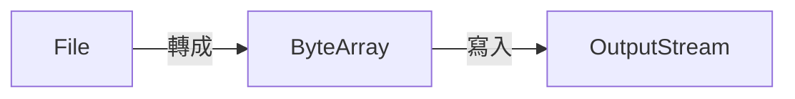
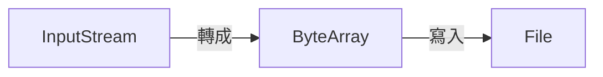

Prerequisites:

- [串流基礎][1]
- [檔案串流][2]
- [Byte Array串流][3]
- [Buffered串流][4]

## Client傳送檔案
1. 本機檔案(File)寫入到記憶體緩衝區(Byte Array)。
2. 記憶體緩衝區寫入到Socket的OutputStream。
3. 告訴伺服器傳輸完成。

### InputStream轉成ByteArray
之前在[ByteArray串流][3]中有提過，工具類別提供InputStream轉成Byte Array的方法。

public class IOUtils {
  public static byte[] streamToByteArray(InputStream is) throws IOException {
    ByteArrayOutputStream bos = new ByteArrayOutputStream();
    byte[] buffer = new byte[1024];
    int len = 0;
    while((len = is.read(buffer)) != -1) {
      bos.write(buffer, 0, len);
    }
    byte[] byteArr = bos.toByteArray();
    bos.close();
    return byteArr;
  }
}


傳送檔案到Server。

public class ClientFile {
  public static void main(String[] args) throws IOException {
    Socket socket = new Socket("127.0.0.1", 9999);
    FileInputStream fis = new FileInputStream("/Users/cici/testc/1.png");
    // File 轉成 Byte Array
    byte[] bytes = IOUtils.streamToByteArray(fis);
    // 取得OutputStream
    OutputStream os = socket.getOutputStream();
    // Byte Array 寫入 OutputStream
    os.write(bytes);
    // 告訴伺服器傳輸完成
    socket.shutdownOutput();
    // 關閉串流
    fis.close();
    os.close();
    socket.close();
  }
}


## Server接收檔案
1. 取得Socket的InputStream
2. InputStream轉成Byte Array。
3. Byte Array寫入檔案。


public class ServerFile {
  public static void main(String[] args) throws IOException {
    // 設定監聽的port number
    ServerSocket serverSocket = new ServerSocket(9999);
    // accept會一直等待有人連上，有人連上會傳回socket物件
    Socket socket = serverSocket.accept();
    // socket包含用戶端傳送的資料，用InputStream取得
    InputStream is = socket.getInputStream();
    // InputStream 轉成Byte Array
    byte[] bytes = IOUtils.streamToByteArray(is);
    // File OutputStream
    FileOutputStream fos = new FileOutputStream("/Users/cici/testc/copy1.png");
    // 將Byte Array 寫入到檔案
    fos.write(bytes);
    // 關閉串流
    fos.close();
    is.close();
    socket.close();
    serverSocket.close();
  }
}


## 執行程式
1. 先執行Server
2. 再執行Client

[1]: 
[2]: 
[3]: #InputStream轉成byte陣列工具
[4]: 