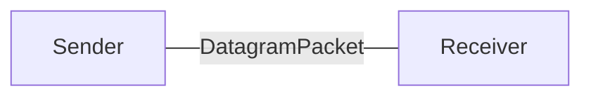

## 介紹
Java的UDP不可靠傳輸協議是使用DatagramSocket與DatagramPacket完成。

DatagramPacket是封包，在二個DatagramSocket間傳輸。

在DatagramSocket下，沒有一台主機是Server或Client，也沒有accept監聽，只有主機跟主機之間的傳輸，每一個主機都是DatagramSocket，為了簡單的稱呼，傳送資料的稱為傳送方(Sender)，接收資料的稱為接收方(Receiver)。



## Port number
傳送方與接收方都要設定埠port number，若傳送方與接收方都在本機，port number要不同。

傳送方

public class UdpSend {
  public static void main(String[] args) throws IOException {
    // 設定埠port number
    DatagramSocket socket = new DatagramSocket(9998);
  }
}


接收方

public class UdpRecv {
  public static void main(String[] args) throws IOException {
    // 設定埠port number
    DatagramSocket socket = new DatagramSocket(9999);
  }
}


## 建立DatagramPacket封包
### 傳送方
建立封包，裡面是傳輸的資料、資料大小、接收方的ip、接收方的port。

public class UdpSend {
  public static void main(String[] args) throws IOException {
    DatagramSocket socket = new DatagramSocket(9998);
    // 傳輸的資料
    byte[] bytes = "哈囉哈囉".getBytes();
    // 建立封包
    // 參數為傳輸的資料、資料大小、接收方的ip、接收方的port
    DatagramPacket packet =
        new DatagramPacket(bytes, bytes.length, InetAddress.getByName("127.0.0.1"), 9999);
  }
}


### 接收方
建立封包，裡面是記憶體暫存區Byte Array、Byte Array長度。

public class UdpRecv {
  public static void main(String[] args) throws IOException {
    DatagramSocket socket = new DatagramSocket(9999);
    // 建立封包，大小設為1024
    byte[] buff = new byte[1024];
    // 建立接收封包
    DatagramPacket packet =
        new DatagramPacket(buff, buff.length);
  }
}


## 傳送封包send

public class UdpSend {
  public static void main(String[] args) throws IOException {
    DatagramSocket socket = new DatagramSocket(9998);
    byte[] bytes = "哈囉哈囉".getBytes();
    DatagramPacket packet =
        new DatagramPacket(bytes, bytes.length, InetAddress.getByName("127.0.0.1"), 9999);
    // 傳送封包
    socket.send(packet);
    socket.close();
  }
}


## 接收封包receive
receive()方法是沒有資料會等待，程序停留在那一行，也就是阻斷(Block)。

收到資料才會往下面的程式碼執行。

public class UdpRecv {
  public static void main(String[] args) throws IOException {
    DatagramSocket socket = new DatagramSocket(9999);
    byte[] buff = new byte[1024];
    DatagramPacket packet =
        new DatagramPacket(buff, buff.length);
    // 接收封包
    // 如果沒有資料傳來就會卡住(Block)
    socket.receive(packet);
    // 有資料才會往下走

    // 取得傳來資料的大小
    int realLen = packet.getLength();
    // 取得資料
    byte[] data = packet.getData();
    String str = new String(data, 0, realLen);
    System.out.println(str);
    socket.close();
  }
}


### getLength()
取得傳來資料的大小。

### getData()
取得傳來的資料。

## 執行
1. 先執行Recv
2. 再執行Send

## 雙向溝通
雙向溝通指的是，接收方收到資料後，會傳送「已收到」給傳送方。

傳送方發送資料後，接收另一方送來的「已收到」，送印出。

Send傳送方

public class UdpSend {
  public static void main(String[] args) throws IOException {
    DatagramSocket socket = new DatagramSocket(9998);
    // 送出
    byte[] bytes = "哈囉哈囉".getBytes();
    DatagramPacket packet =
        new DatagramPacket(bytes, bytes.length, InetAddress.getByName("127.0.0.1"), 9999);
    socket.send(packet);

    // 接收
    byte[] buff = new byte[1024];
    packet = new DatagramPacket(buff, buff.length);
    // 如果沒有資料傳來就會卡住(Block)
    socket.receive(packet);
    // 有資料才會往下走
    int realLen = packet.getLength();
    byte[] data = packet.getData();
    String str = new String(data, 0, realLen);
    System.out.println(str);
    socket.close();
  }
}

```
已收到資料
```

Recv接收方

public class UdpRecv {
  public static void main(String[] args) throws IOException {
    DatagramSocket socket = new DatagramSocket(9999);
    byte[] buff = new byte[1024];
    DatagramPacket packet =
        new DatagramPacket(buff, buff.length);
    // 如果沒有資料傳來就會卡住(Block)
    socket.receive(packet);
    // 有資料才會往下走
    int realLen = packet.getLength();
    byte[] data = packet.getData();
    String str = new String(data, 0, realLen);
    System.out.println(str);

    // 傳送資料
    data = "已收到資料".getBytes();
    packet = new DatagramPacket(data, data.length, InetAddress.getByName("127.0.0.1"), 9998);
    socket.send(packet);
    socket.close();
  }
}

```
哈囉哈囉
```