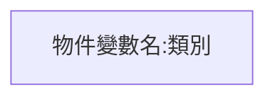
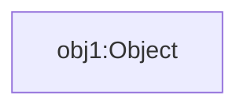

英文是Sequence Diagram，中文有不同翻譯，如:順序圖、序列圖、循序圖、時序圖。

主要是用來表達物件與物件之間交互動作，與物件的生命周期。

## 物件
物件變數名 冒號: 類型




Object obj1;




## 生命線
表達物件的Life Cycle


## destory
代表結束。


有些圖是省略不畫。

## 呼叫方法
注意！呼叫箭頭指向的物件的方法。


都直接寫方法()，前面不會加上變數名。



Object obj1;
obj1.toString();


## 方法執行的時段


有些圖是省略不畫。

## 呼叫其它物件與傳回值
在start()方法中，呼叫其它類別UserInfo，物件變數名是user，呼叫getName()方法。

傳回的線為虛線。

注意！name是傳回的值，不是呼叫方法()，後面有圓括號()的才是方法()。


## 由左往右開始
執行順序是由左往右。

下圖中的順序如下
1. 呼叫buy.start()
2. 呼叫user.getName()
3. 取得name
4. 呼叫bankCard.cardNumber()
5. 取得信用卡號
6. 呼叫bankCard.pay()
7. 傳回成功或失敗的代碼，rtnCode。


## 同一個類別，不同物件

下圖有二個類別，分別為Transfer轉帳與Account帳戶。

下圖中有三個物件，分別為transfer與account1與account2。

下圖中執行的順序如下
1. 呼叫transfer.轉帳()
2. 呼叫account1.檢查餘額()
3. 取得餘額
4. 呼叫account1.提款()
5. 傳回成功或失敗代碼，rtnCode
6. 呼叫account2.轉帳()
7. 傳回成功或失敗代碼，rtnCode


## 建立匿名物件
匿名物件就是沒有名字的物件。

匿名物件表示方式`冒號: 類別`。

建立的箭頭為虛線，箭頭非實心，指向匿名物件的方框，箭頭線上的文字`<<create>>`。


## 方法可以有參數
語法
```
方法(參數1, 參數2)
```

## 自己呼叫自己


## loop


## 十分簡單的順序圖

