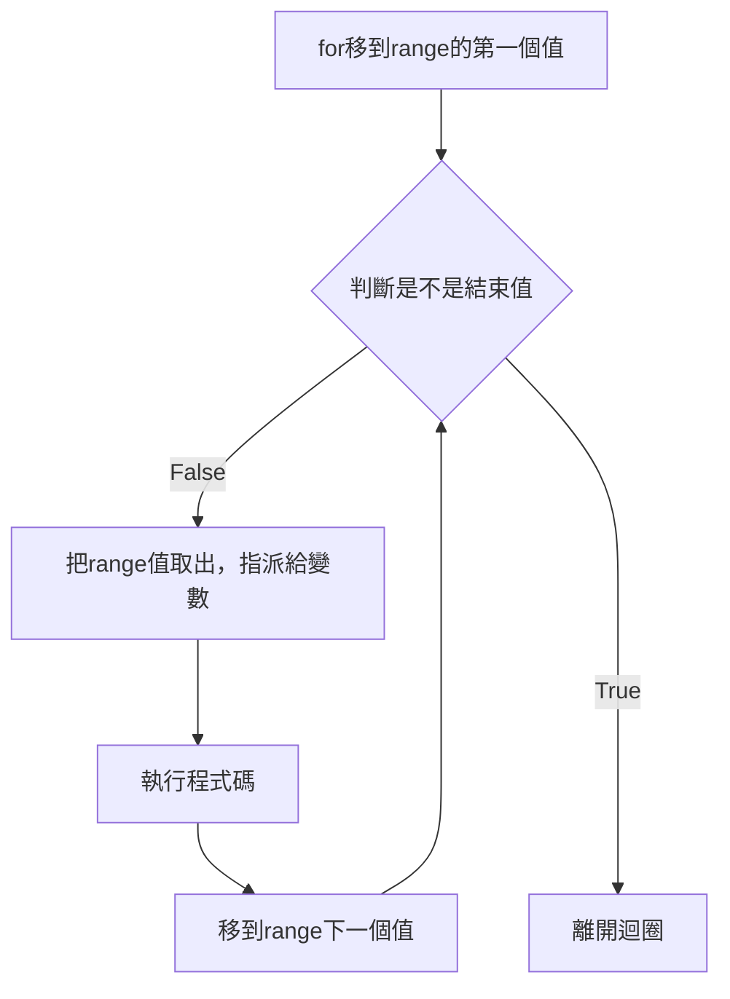
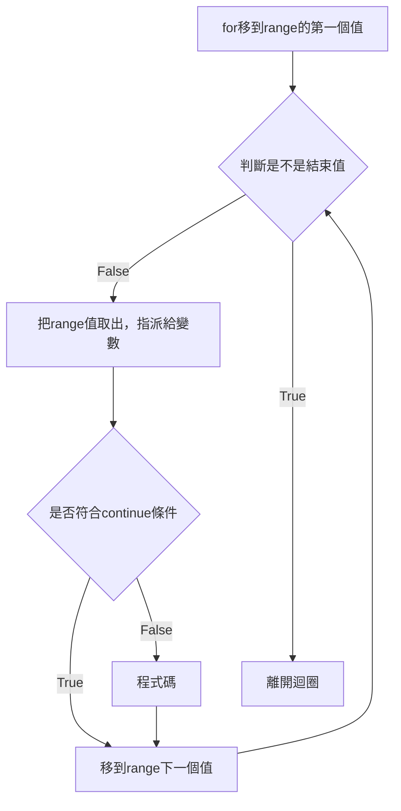

Prerequisites:

- [range][1]

## for介紹
for 流程如下:
1. for移到range的第一個值。
2. 檢查是不是結束值
3. 不是結束值，把range的值取出來，並把值指派給「變數」
4. 執行程式碼。
5. 移到range下一個值，回到步驟2。


語法
```
for 變數 in range(結束值):
    程式碼

for i in range(1, 10, 1):
    print(i)
```



## for 與 range
產生1, 3, 5, 7, 9的數字，不包含10。<br>

for i in range(1, 10, 2):
    print(i)

```
1
3
5
7
9
```

產生5句Hello。<br>

for i in range(5):
    print("Hello")

```
Hello
Hello
Hello
Hello
Hello
```

### 離開迴圈，i變數仍能使用
Python的迴圈變數跟其它程式語言不同，離開for迴圈後，迴圈變數i仍能使用。<br>

for i in range(5):
    print("Hello", i)
print("i = ", i)

```
Hello 0
Hello 1
Hello 2
Hello 3
Hello 4
i =  4
```

### `end=""` 不要換行
print後面加上`end=""`，就不會換行。

for i in range(1, 10, 2):
    print(i, end="")

```
13579
```

## list
### list語法
```
[1, 3, 5, 7]
```
使用`[]`，建立list。<br>


data = [1, 3, 5, 7]
print(data, type(data)

```
[1, 3, 5, 7] <class 'list'>
```

## list 與 for
以下二種程式碼執行結果都一樣。<br>

data = [1, 3, 5, 7]
for i in data:
    print(i)

```
1
3
5
7
```


for i in [1, 3, 5, 7]:
    print(i)

```
1
3
5
7
```

## 雙層for迴圈
當i為1，會配對j為1、2、3。<br>
當i為2，會配對j為1、2、3。<br>
j都是固定為1、2、3。<br>

<br>


for i in [1,2]:
    for j in [1,2,3]:
        print(f"i = {i} and j = {j}")

```
i = 1 and j = 1
i = 1 and j = 2
i = 1 and j = 3
i = 2 and j = 1
i = 2 and j = 2
i = 2 and j = 3
```

## for else break
如果for正確執行完，沒有被break，會到else的區塊中。<br>

for i in range(1, 10, 2):
    print(i)
else:
    print("else finish")

```
1
3
5
7
9
else finish
```

如果遇到break，就不會進到else的區塊。<br>

for i in range(1, 10, 2):
    print(i)
    if i == 5:
        break
else:
    print("else finish")

```
1
3
5
```

如果是雙層for迴圈，else會對映自己的for迴圈。<br>
以下程式碼，break是發生在第二層for迴圈中，第一層else不會接收到第二層的break，所以第一層的else程式碼區塊仍會執行。<br>

for i in range(1,3):
    for j in range(1,4):
        if j==2:
            break
        print(f"i = {i}, j = {j}")
else:
    print("else finish")

```
i = 1, j = 1
i = 2, j = 1
else finish
```

## continue
continue並非離開迴圈。<br>

continue 流程如下:<br>
1. for移到range的第一個值。
2. 檢查是不是結束值
3. 不是結束值，把range的值取出來，並把值指派給「變數」
4. 是否進入continue條件
5. 若為進入continue條件，回到步驟7。
6. 若不進入continue條件，執行程式碼
7. 移到range下一個值，回到步驟2。



符合continue的條件就不執行contnue之後的程式碼。<br> 
以下程式碼，遇到i==3，就不輸出，直接移到range下一個值，判斷是不是結束值，若不為結束值就進入for迴圈。<br>

for i in range(1,5):
    if i == 3:
        continue
    print(i)
else:
    print("for finish")

```
1
2
4
for finish
```

[1]: 

