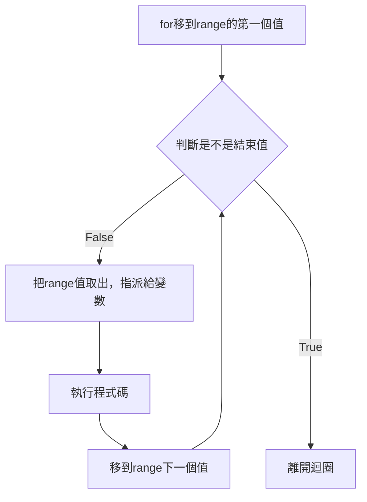
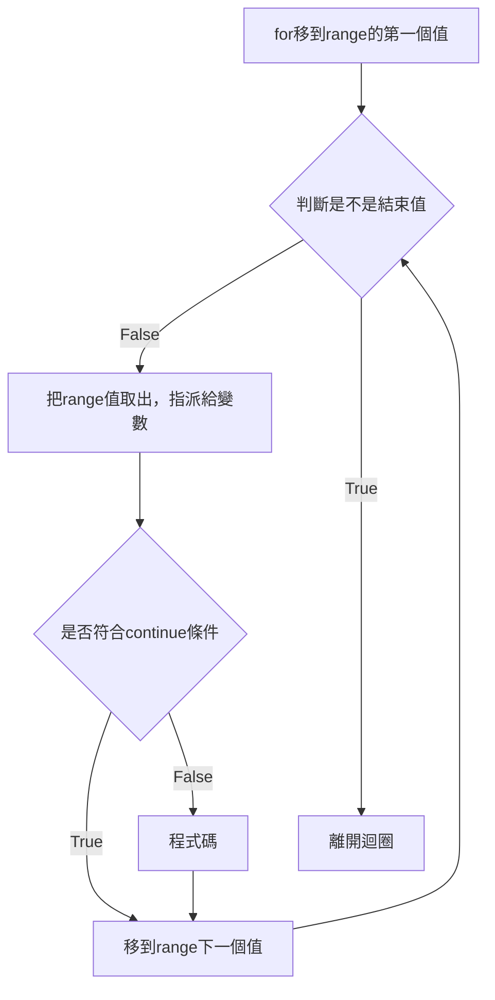

## range 不可變序列
range函式文件網址<https://docs.python.org/zh-tw/3.14/library/functions.html#func-range>

### 參數介紹
```
range(起始值start, 不包含結束值stop, 間隔step)
range(0, 10, 1)
```
以上產生0 - 9的數字 0, 1, 2, 3 ... 9

數學公式如下:
```
起始值start <= 要產生的數字 < 結束值stop
```

注意！不包含結束值10。

使用range，要用list(range)，把range強制轉型成list，才可以顯示數字。
```
list(range)
```


r = range(0, 10, 1)
print(list(r))

```
[0, 1, 2, 3, 4, 5, 6, 7, 8, 9]
```

### 參數預設值
start 預設為0 <br>
step 預設為1 <br>

### range(10)
產生0 - 9的數字，因為start預設為0，step預設為1，若只有代入一個參數，這個參數是stop結束值，因為只有結束值沒有預設值，是必填，注意！不包含結束值。<br>

r = range(10)
print(list(r))

```
[0, 1, 2, 3, 4, 5, 6, 7, 8, 9]
```

### range(1, 10)
產生1 - 9的數字，因為start修改為1，step預設為1，若只有代入二個參數，第1個參數是start = 1，第二個參數是stop結束值，注意！不包含結束值。<br>

r = range(1, 10)
print(list(r))

```
[1, 2, 3, 4, 5, 6, 7, 8, 9]
```

### range(1, 10, 2)
產生1, 3, 5, 7, 9的數字，不包含10。<br>
start修改為1，step修改為2。<br>


r = range(1, 10, 2)
print(list(r))

```
[1, 3, 5, 7, 9]
```

## for介紹
for 流程如下:
1. for移到range的第一個值。
2. 檢查是不是結束值
3. 不是結束值，把range的值取出來，並把值指派給「變數」
4. 執行程式碼。
5. 移到range下一個值，回到步驟2。


語法
```
for 變數 in range(結束值):
    程式碼

for i in range(1, 10, 1):
    print(i)
```



## for 與 range
產生1, 3, 5, 7, 9的數字，不包含10。<br>

for i in range(1, 10, 2):
    print(i)

```
1
3
5
7
9
```

產生5句Hello。<br>

for i in range(5):
    print("Hello")

```
Hello
Hello
Hello
Hello
Hello
```

### 離開迴圈，i變數仍能使用
Python的迴圈變數跟其它程式語言不同，離開for迴圈後，迴圈變數i仍能使用。<br>

for i in range(5):
    print("Hello", i)
print("i = ", i)

```
Hello 0
Hello 1
Hello 2
Hello 3
Hello 4
i =  4
```

### `end=""` 不要換行
print後面加上`end=""`，就不會換行。

for i in range(1, 10, 2):
    print(i, end="")

```
13579
```

## list
### list語法
```
[1, 3, 5, 7]
```
使用`[]`，建立list。<br>


data = [1, 3, 5, 7]
print(data, type(data)

```
[1, 3, 5, 7] <class 'list'>
```

## list 與 for
以下二種程式碼執行結果都一樣。<br>

data = [1, 3, 5, 7]
for i in data:
    print(i)

```
1
3
5
7
```


for i in [1, 3, 5, 7]:
    print(i)

```
1
3
5
7
```

## 雙層for迴圈
當i為1，會配對j為1、2、3。<br>
當i為2，會配對j為1、2、3。<br>
j都是固定為1、2、3。<br>

<br>


for i in [1,2]:
    for j in [1,2,3]:
        print(f"i = {i} and j = {j}")

```
i = 1 and j = 1
i = 1 and j = 2
i = 1 and j = 3
i = 2 and j = 1
i = 2 and j = 2
i = 2 and j = 3
```

## for else break
如果for正確執行完，沒有被break，會到else的區塊中。<br>

for i in range(1, 10, 2):
    print(i)
else:
    print("else finish")

```
1
3
5
7
9
else finish
```

如果遇到break，就不會進到else的區塊。<br>

for i in range(1, 10, 2):
    print(i)
    if i == 5:
        break
else:
    print("else finish")

```
1
3
5
```

如果是雙層for迴圈，else會對映自己的for迴圈。<br>
以下程式碼，break是發生在第二層for迴圈中，第一層else不會接收到第二層的break，所以第一層的else程式碼區塊仍會執行。<br>

for i in range(1,3):
    for j in range(1,4):
        if j==2:
            break
        print(f"i = {i}, j = {j}")
else:
    print("else finish")

```
i = 1, j = 1
i = 2, j = 1
else finish
```

## continue
continue並非離開迴圈。<br>

continue 流程如下:<br>
1. for移到range的第一個值。
2. 檢查是不是結束值
3. 不是結束值，把range的值取出來，並把值指派給「變數」
4. 是否進入continue條件
5. 若為進入continue條件，回到步驟7。
6. 若不進入continue條件，執行程式碼
7. 移到range下一個值，回到步驟2。



符合continue的條件就不執行contnue之後的程式碼。<br> 
以下程式碼，遇到i==3，就不輸出，直接移到range下一個值，判斷是不是結束值，若不為結束值就進入for迴圈。<br>

for i in range(1,5):
    if i == 3:
        continue
    print(i)
else:
    print("for finish")

```
1
2
4
for finish
```

## list記憶體位址
Prerequisites:

- [id][1]
- [C++ 指標陣列][2]

先前在id的文章中提到，英文大小寫字母、數字0-9、底線，為了節省記憶體空間，Python都會指向相同記憶體位址。<br>

Python list的記憶體位址分配跟C++、Java不一樣。<br>

由以下程式碼可以看出x變數、`nums[0]`、`nums[1]`、`nums[2]`、`nums[3]`全指向同一個記憶體位址。<br>

|0|1|2|3|
|:--------:|:--------:|:--------:|:--------:|
|4370549520|4370549520|4370549520|4370549520|


nums = [1, 1, 1, 1]
x = 1
print("address of nums = ", id(nums))
print("address of nums[0] = ", id(nums[0]))
print("address of nums[1] = ", id(nums[1]))
print("address of nums[2] = ", id(nums[2]))
print("address of nums[3] = ", id(nums[3]))
print("address of x = ", id(x))

```
address of nums =  4360423744
address of nums[0] =  4370549520
address of nums[1] =  4370549520
address of nums[2] =  4370549520
address of nums[3] =  4370549520
address of x =  4370549520
```

用C++的觀點是，建立一個指標陣列，指標就是記憶體位址，陣列中儲存的是記憶體位址。<br>

int* array[4];
int var1 = 1;
array[0] = &var1;
array[1] = &var1;
array[2] = &var1;
array[3] = &var1;


記憶體位址4370549520儲存「1」的數值。
```
4370549520 → 1
```

指標陣列儲存的是記憶體位址，陣列中的pointer都是1的address。
```
 4360423744
[    0    ][    1    ][    2    ][    3    ]
[ pointer ][ pointer ][ pointer ][ pointer ]
[   &1    ][   &1    ][   &1    ][   &1    ]
[ 4370549520 ][ 4370549520 ][ 4370549520 ][ 4370549520 ]
```

而nums則是指向指標陣列`[0]`的記憶體位址4360423744，指標陣列`[0]`儲存的內容是1的記憶體位址4370549520。<br>

[1]: 
[2]: 