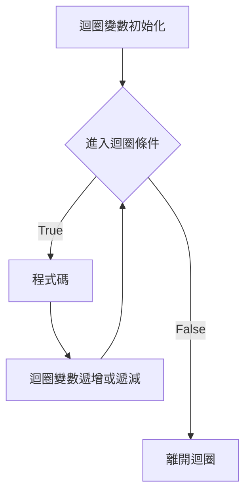

## 語法
```
迴圈變數初始化
while 進入迴圈條件:
  程式碼
  迴圈變數遞增或遞減
```


當進入迴圈條件為True，才進入迴圈，執行程式碼。<br>

重點
- 迴圈條件是boolean，True或False。
- 要有迴圈變數遞增或遞減，最後變數符合離開迴圈的條件。<br>
- 如果沒有迴圈變數沒有變化，會形成無窮迴圈。<br>
- 迴圈變數遞增或遞減可放在程式碼區塊最後面，或放在「程式碼」前面。<br>


i = 1
while i < 5:
    print(i)
    i += 1

```
1
2
3
4
```

## 無限迴圈
語法
```
while True:
    if 離開迴圈的條件:
    	break
    程式碼
```
使用True無限迴圈，一定要設定「離開迴圈的條件」，否則無法離開迴圈。<br>


i = 1
while True:
    if i >= 5:
        break
    print(i)
    i += 1

```
1
2
3
4
```

## while else break
若while正常的執行，沒有遇到break，就會到else區塊。<br>

i = 1
while i < 5:
    print(i)
    i += 1
else:
    print("else")

```
1
2
3
4
else
```

遇到break，就不會執行else中的程式碼。<br>

i = 1
while i < 5:
    if (i == 3):
        break
    print(i)
    i = i + 1
    print(i)
    i += 1
else:
    print("else")
print("i = ", i)

```
1
2
i =  3
```